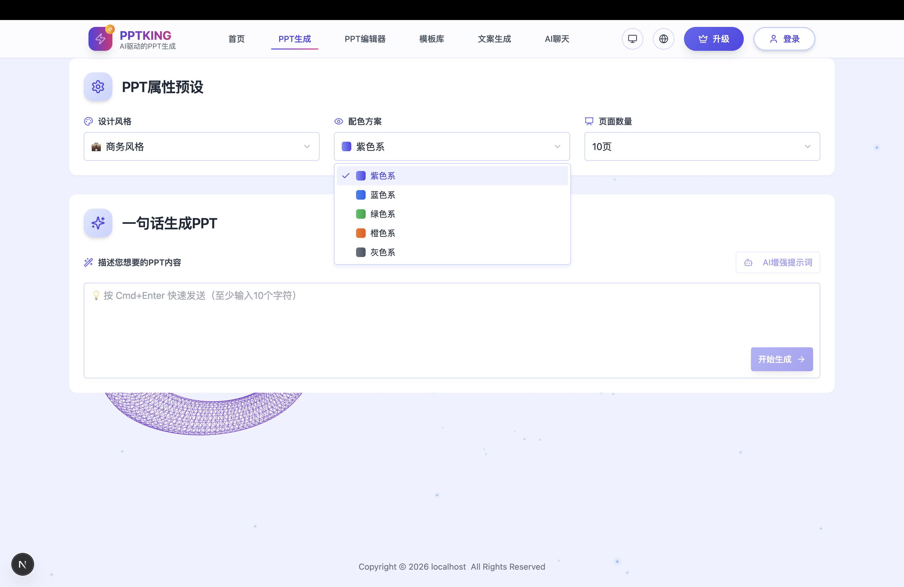
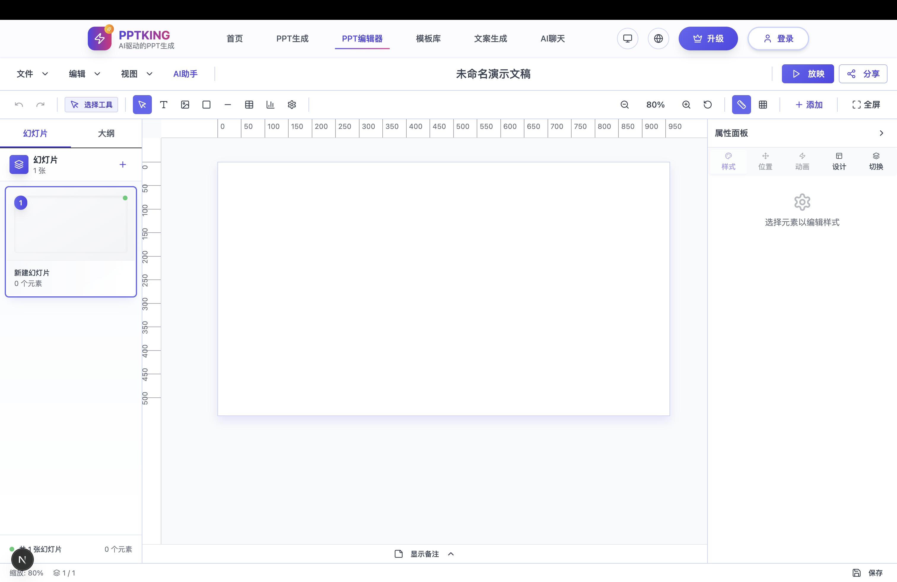
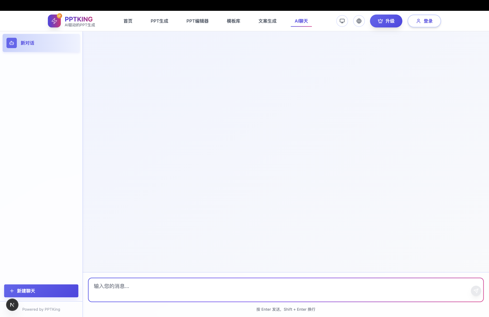

# PPT King AI智能创作平台

`这是一个手搓的AI生成PPT项目以及附带一个高定PPT编辑器项目，由于空闲时间投入其他项目现将本项目开源`

<div align="center">
  <h3>🎨 智能PPT创作平台 | AI-Powered Presentation Creator</h3>
  <p>基于 Next.js 和 AI 技术的专业演示文稿制作工具</p>
  
  [](https://nextjs.org/)
  [](https://reactjs.org/)
  [](https://www.typescriptlang.org/)
  [](https://supabase.io/)
  [](https://tailwindcss.com/)
</div>

---

## 🌟 项目简介

PPT Visionary AI 是一个功能强大的在线演示文稿制作平台，结合了现代 Web 技术和人工智能能力。用户可以通过直观的界面创建专业级的PPT演示文稿，支持多种元素类型、动画效果、AI辅助创作等功能。

## 📸 功能展示

<div align="center">

### 🏠 首页界面


### 🤖 AI 智能生成 PPT


### ✏️ PPT在线编辑器


### 💬 AI 聊天助手


</div>

### ✨ 核心特性

- **🎯 专业编辑器**: 功能完整的PPT编辑器，支持文本、图片、形状、图表等多种元素
- **🤖 AI智能助手**: 集成多个AI模型，提供智能内容生成和优化建议
- **📱 跨平台支持**: 支持桌面端和移动端，响应式设计适配各种设备
- **☁️ 云端存储**: 基于 Supabase 的数据存储，支持实时同步和协作
- **🎨 丰富模板**: 内置多种专业模板和主题样式
- **🔐 多种登录**: 支持微信登录等多种认证方式
- **📤 多格式导出**: 支持导出为 PPTX、PDF、图片等多种格式
- **🎪 演示模式**: 专业的全屏演示模式，支持演讲者视图和手写批注

## 🏗️ 技术架构

### 前端技术栈
- **框架**: Next.js 15 (React 19) - App Router
- **语言**: TypeScript 5.8
- **样式**: Tailwind CSS + shadcn/ui
- **状态管理**: Zustand + React Context
- **UI组件**: Radix UI + 自定义组件库
- **动画**: Framer Motion
- **图表**: ECharts
- **富文本**: ProseMirrorgit
- **数学公式**: KaTeX
- **本地存储**: IndexedDB (Dexie)

### 后端服务
- **数据库**: Supabase (PostgreSQL)
- **认证**: Supabase Auth + 微信登录
- **云函数**: Supabase Edge Functions
- **文件存储**: Supabase Storage
- **API**: Next.js API Routes

### AI 集成
- **模型支持**: OpenAI GPT、SiliconFlow、OpenRouter
- **功能**: 智能内容生成、文案优化、结构建议
- **流式响应**: 支持实时AI对话和内容生成

## 🚀 功能特性

### 📝 编辑功能
- **多元素支持**: 文本、图片、形状、线条、图表、表格、LaTeX公式、音视频
- **智能操作**: 拖拽、缩放、旋转、对齐、分布、组合、锁定
- **格式刷**: 快速应用样式到其他元素
- **历史记录**: 无限级撤销/重做功能
- **快捷键**: 完整的键盘快捷键支持
- **磁性对齐**: 智能对齐辅助线和吸附功能

### 🎨 设计系统
- **主题管理**: 多种内置主题，支持自定义配色
- **模板库**: 丰富的专业模板资源
- **样式面板**: 详细的样式编辑面板
- **渐变系统**: 支持线性和径向渐变
- **阴影效果**: 多种阴影样式选择

### 🎬 动画系统
- **入场动画**: 淡入、滑入、缩放、旋转等效果
- **退场动画**: 淡出、滑出等效果
- **强调动画**: 脉冲、摇摆、弹跳等效果
- **页面切换**: 多种页面切换动画
- **触发方式**: 点击、自动、同时触发

### 📊 图表功能
- **图表类型**: 柱状图、折线图、饼图、环形图、面积图、散点图、雷达图
- **数据管理**: 支持多系列数据编辑
- **主题配置**: 图表主题和颜色定制
- **动态更新**: 实时数据更新和动画

### 🎭 演示模式
- **全屏演示**: 专业的演示播放模式
- **演讲者视图**: 双屏演讲者专用界面
- **手写批注**: 支持手写笔记和标注
- **激光笔**: 虚拟激光笔功能
- **倒计时**: 演示时间控制
- **自动播放**: 自动翻页功能

### 📱 移动端支持
- **响应式设计**: 适配各种屏幕尺寸
- **触摸操作**: 优化的触摸交互
- **移动编辑**: 基础的移动端编辑功能
- **移动预览**: 移动端演示预览

### 🔐 用户系统
- **多种登录**: 微信登录、邮箱登录等
- **用户资料**: 完整的用户信息管理
- **权限控制**: 基于角色的访问控制
- **会话管理**: 安全的用户会话管理

## 📦 安装部署

### 环境要求
- Node.js 18+ 
- npm/yarn/pnpm
- Git

### 本地开发

本项目基本数据存储使用supabase, 请先注册申请key, 免费。
- supabase 数据存储
- 微信网页应用AKSK，微信用户登录
- open router API KEY， 调用大模型， 支持的模型供应商详见 .env.example

1. **克隆项目**
```bash
git clone https://github.com/zeeklog/pptking.git
cd pptking
```

2. **安装依赖**
```bash
npm install
# 或
yarn install
# 或
pnpm install
```

3. **环境配置**
```bash
cp env.example .env.local
```

编辑 `.env.local` 文件，配置必要的环境变量。详细的环境变量说明请参考 `env.example` 文件中的中文注释。

**必需配置：**
- `NEXT_PUBLIC_SUPABASE_URL` - Supabase 项目 URL
- `NEXT_PUBLIC_SUPABASE_PUBLISHABLE_KEY` - Supabase 公开密钥
- `SUPABASE_SERVICE_ROLE_KEY` - Supabase 服务角色密钥

**可选配置：**
- 微信登录相关配置
- AI API 密钥（OpenAI、SiliconFlow、OpenRouter 等）
- 其他功能开关配置

> 💡 提示：所有环境变量都有详细的中文注释说明，请根据 `env.example` 文件进行配置。

4. **启动开发服务器**
```bash
npm run dev
# 或
yarn dev
# 或
pnpm dev
```

访问 [http://localhost:3000](http://localhost:3000) 查看应用。

### 生产部署

#### Vercel 部署（推荐）
```bash
# 安装 Vercel CLI
npm i -g vercel

# 部署到 Vercel
vercel --prod
```

#### Cloudflare Pages 部署
```bash
# 构建项目
npm run build

# 部署到 Cloudflare Pages
npm run cf:deploy

# 构建 GitHub Pages 版本（静态导出）
npm run build:github-pages
```

#### GitHub Pages 部署

项目已配置自动部署到 GitHub Pages。部署步骤：

1. **启用 GitHub Pages**：
   - 前往仓库 Settings > Pages
   - Source 选择 "GitHub Actions"

2. **配置环境变量**：
   - 在 Settings > Secrets and variables > Actions 中添加：
     - `NEXT_PUBLIC_SUPABASE_URL`
     - `NEXT_PUBLIC_SUPABASE_PUBLISHABLE_KEY`

3. **自动部署**：
   - 推送到 `main` 分支会自动触发部署
   - 或手动在 Actions 标签页触发

4. **访问网站**：
   - 部署完成后访问：`https://zeeklog.github.io/pptking/`

⚠️ **注意**：GitHub Pages 只支持静态站点，API 路由在静态导出模式下不可用。详细说明请查看 [.github/DEPLOYMENT.md](.github/DEPLOYMENT.md)

#### Docker 部署
```bash
# 构建 Docker 镜像
docker build -t pptking .

# 运行容器
docker run -p 3000:3000 pptking
```

## ⚙️ 配置指南

### Supabase 设置

1. 在 [Supabase](https://supabase.com) 创建新项目
2. 运行数据库迁移：
```bash
supabase db push
```
3. 部署云函数：
```bash
supabase functions deploy
```

### AI API 配置

项目支持多个AI服务提供商：

- **OpenAI**: 官方 GPT 模型
- **SiliconFlow**: 国内AI服务商，支持多种开源模型
- **OpenRouter**: 统一的AI模型接口

在设置页面配置对应的API密钥即可使用。

### 微信登录配置

1. 在微信开放平台申请应用
2. 配置回调域名
3. 设置环境变量中的 AppID 和 AppSecret

## 📖 使用指南

### 基础使用

1. **创建演示文稿**: 点击"新建PPT"开始创建
2. **添加内容**: 使用左侧工具栏添加各种元素
3. **编辑样式**: 通过右侧属性面板调整样式
4. **添加动画**: 在动画面板设置入场和退场效果
5. **预览演示**: 点击"演示"按钮进入全屏模式
6. **导出分享**: 导出为PPTX或PDF格式

### AI 助手使用

1. **智能生成**: 在聊天界面描述需求，AI会生成PPT大纲
2. **内容优化**: 选中文本后使用AI重写功能
3. **设计建议**: AI会根据内容提供设计建议
4. **模板推荐**: 基于主题推荐合适的模板

### 高级功能

- **协作编辑**: 多人同时编辑同一份PPT
- **版本控制**: 自动保存历史版本
- **模板管理**: 创建和管理自定义模板
- **数据可视化**: 导入数据生成图表

## 🛠️ 开发指南

### 项目结构
```
pptking/
├── app/                    # Next.js App Router
│   ├── api/               # API 路由
│   ├── components/        # React 组件
│   ├── contexts/          # React Context
│   ├── hooks/             # 自定义 Hooks
│   ├── lib/               # 工具库
│   ├── ppt-edit/          # PPT编辑器核心
│   └── styles/            # 样式文件
├── supabase/              # Supabase 配置
│   ├── functions/         # Edge Functions
│   └── migrations/        # 数据库迁移
├── public/                # 静态资源
└── lib/                   # 第三方库
```

### 开发规范

- **代码风格**: 使用 ESLint + Prettier
- **类型检查**: 严格的 TypeScript 配置
- **组件规范**: 函数式组件 + Hooks
- **状态管理**: Zustand + Context
- **样式规范**: Tailwind CSS + CSS Modules

### 贡献指南

1. Fork 项目
2. 创建特性分支 (`git checkout -b feature/AmazingFeature`)
3. 提交更改 (`git commit -m 'Add some AmazingFeature'`)
4. 推送到分支 (`git push origin feature/AmazingFeature`)
5. 创建 Pull Request

## 📝 更新日志

### v1.0.0 (2025-01-XX)
- 🎉 首次发布
- ✨ 完整的PPT编辑功能
- 🤖 AI助手集成
- 📱 移动端支持
- 🔐 用户认证系统

## 🤝 贡献者

感谢所有为这个项目做出贡献的开发者！

## 📄 许可证

本项目采用 [MIT License](LICENSE) 许可证。

## 🆘 支持与反馈

- **问题报告**: [GitHub Issues](https://github.com/zeeklog/pptking/issues)
- **功能建议**: [GitHub Discussions](https://github.com/zeeklog/pptking/discussions)
- **技术支持**: support@zeeklog.com

## 🔗 相关链接

- [在线演示](https://pptking.cn)
- [更新日志](CHANGELOG.md)

---

<div align="center">
  <p>如果这个项目对你有帮助，请给我们一个 ⭐️</p>
  <p>Made with ❤️ by Ne0 and 🛜 Hosted on pptking.cn</p>
</div>